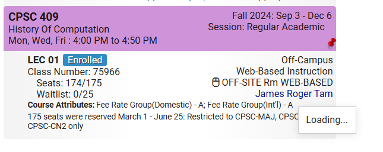
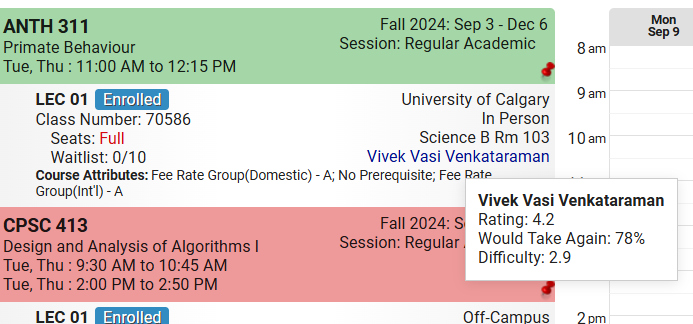
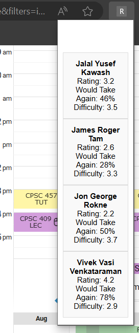

# RMP-Extension

A Chrome extension that fetches and displays professor ratings, difficulty levels, and feedback for over 3,000 professors on the schedule builder page for UCalgary. Built with a Node.js backend and Puppeteer, this tool automates web scraping and delivers real-time insights to users in a user-friendly interface.


## Features

- **Real-Time Ratings**: Fetch and display professor ratings, difficulty levels, and feedback directly within the extension.
- **Automated Data Scraping**: Uses Puppeteer to scrape and update over 10,000 ratings from RateMyProfessors.
- **Seamless Interaction**: Implements asynchronous communication between content and background scripts to dynamically gather and display data.
- **Friendly Interface**: Data is organized and displayed in a basic intuitive popup format for easy access.
  
---

## Installation

1. Clone the repository:
   ```bash
   git clone https://github.com/alia720/RMP-Extension.git
   cd RMP-Extension

2. Install dependencies:
   ```bash
   npm install

3. Build the extension:
   ```bash
   npm run build

4. Start the backend server:
   ```bash
   cd RMP-Extension
   node server.js
   
5. Load the extension into Chrome:
   1. Open your browser and navigate to `chrome://extensions/`.
   2. Enable **Developer mode** using the toggle in the top-right corner.
   3. Click **Load unpacked** and select the `GExtension` folder inside this repository.
   4. The extension should now be loaded and ready for use.

---

## Screenshots

Below are some images showcasing the functionality and user interface of the **RMP-Extension**. Click on any image to view it in full size.

1. **Loading Animation**:  
   <a href="Images/Loading.png" target="_blank">
      
   </a>

2. **Professor Ratings Popup**:  
   <a href="Images/ProfRating.png" target="_blank">
      
   </a>
   
3. **List of All Professors**:  
   <a href="Images/ListOfAll.png" target="_blank">
      
   </a>
